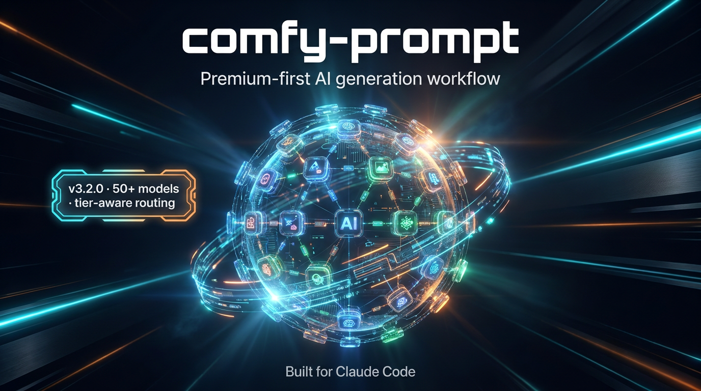

# comfy-prompt

> Premium-first AI generation workflow for Comfy Cloud. Every task auto-routes to the highest-quality model by default.



A Claude Code skill that turns Comfy Cloud — 50+ image and video models including Gemini 3 Pro, Flux Ultra, Kling v3, Seedance, Ideogram, DALL-E, Recraft, Reve — into a single coherent, tier-aware command-line workflow.

Built by [@mvanhorn](https://github.com/mvanhorn)-inspired prompt structure · v3.2.0 · MIT · Deployed and extended by [DaWizKid](https://github.com/404kidwiz)

---

## Why this exists

Most AI image/video tooling makes one generation easy and ten generations chaos. Each model wants different prompt language. Flux wants cinematic vocabulary and `/32` dimensions. DALL-E wants natural sentences and size strings. Kling wants `--model_name`. Pika wants camelCase floats. Switching models means rewriting prompts. Tracking spend means digging through CLI history. Picking the "right model for the job" means memorizing 50+ schemas.

`comfy-prompt` fixes that with three structural moves:

1. **Premium by default, budget when needed.** Every task auto-routes to the best model. Pass `--budget` to scale back in one shot.
2. **Tier-aware resolver.** S/A/B/C tiers per task type. `cf auto image "..."` picks Gemini 3 Pro. `cf auto video-t2v "..."` picks Kling v3. No guessing.
3. **Schema introspection at runtime.** New models auto-detected. Dimension constraints applied per-model (Flux requires /32, Pika uses camelCase float, DALL-E uses size strings — handled).

---

## Quick start

```bash
# Install
ln -sf ~/.claude/skills/comfy-prompt/bin/cf ~/.local/bin/cf
export COMFY_API_KEY=comfyui-...

# Premium image (auto-routed to Gemini 3 Pro)
cf auto image "matte black coffee mug on wooden counter, golden hour"

# Premium video (auto-routed to Kling v3)
cf auto video-t2v "drone shot over Tokyo at night, neon reflections, 10 seconds"

# Budget mode (downshift everything to B tier)
cf auto image "draft concept exploration" --budget

# Preview tier resolution without spending
cf tiers image           # → nano-banana --model gemini-3-pro-image-preview
cf tiers video-t2v       # → kling --model_name kling-v3
cf tiers image --budget  # → flux-pro
```

---

## The tier system

Premium quality is the default. Budget mode is opt-in.

| Tier | Quality | When to use |
|------|---------|-------------|
| **S** | Best-in-class. No compromise. | Hero shots, finals, client deliverables. **Default.** |
| A | Strong premium. ~70% of S quality, ~50% of S cost. | High-volume premium work. |
| B | Solid mid. Reliable, fast. | Internal review, mood boards, drafts that survive. |
| C | Bargain. | Iteration, throwaway tests. |

**Premium S-tier defaults:**

| Task | Model | Cost |
|------|-------|------|
| `image` | `nano-banana --model gemini-3-pro-image-preview` (Gemini 3 Pro) | $0.15 |
| `image-text` (poster, sign) | `ideogram` | $0.04 |
| `image-edit` | `flux-kontext-max` | $0.12 |
| `illustration` | `recraft` | $0.03 |
| `inpaint` | `flux-fill` | $0.06 |
| `outpaint` | `flux-expand` | $0.06 |
| `bg-remove` | `recraft-rmbg` | $0.02 |
| `bg-replace` | `recraft-replace-bg` | $0.07 |
| `upscale` | `recraft-upscale-creative` | $0.15 |
| `video-t2v` | `kling --model_name kling-v3` | $0.60 |
| `video-i2v` | `kling-i2v --model_name kling-v3` | $0.60 |

Full S/A/B/C tier matrix → [`model-guide.md`](./model-guide.md).

---

## Models supported

| Partner | Image models | Video models |
|---------|--------------|--------------|
| **BFL (Flux)** | flux-2, flux-pro, flux-ultra, flux-kontext, flux-kontext-max, flux-canny, flux-depth, flux-fill, flux-expand | — |
| **Google (Gemini)** | nano-banana (gemini-2.5-flash-image, gemini-3-pro-image-preview) | — |
| **OpenAI** | dalle, dalle-edit | — |
| **Ideogram** | ideogram, ideogram-edit, ideogram-bg, ideogram-reframe, ideogram-remix | — |
| **Stability AI** | stability-sd3, stability-ultra, stability-upscale, stability-upscale-fast, stability-upscale-creative | — |
| **xAI** | grok, grok-edit | grok-video |
| **Recraft** | recraft, recraft-i2i, recraft-inpaint, recraft-rmbg, recraft-replace-bg, recraft-vectorize, recraft-upscale, recraft-upscale-creative | — |
| **Reve** | reve, reve-edit | — |
| **Kling** | — | kling, kling-i2v, kling-lipsync, kling-extend (v1, v1-5, v1-6, v2-master, v2-1, v2-1-master, v2-5-turbo, v2-6, v3) |
| **ByteDance** | — | seedance |
| **Pika** | — | pika, pika-i2v |
| **Runway** | runway | runway-i2v |
| **MiniMax** | — | hailuo |
| **Luma** | — | luma, luma-i2v |
| **Vidu** | — | vidu, vidu-i2v, vidu-extend |
| **MoonValley** | — | moonvalley-t2v, moonvalley-i2v |

Plus 60+ local ComfyUI blueprints for Flux, Qwen-Image, Z-Image, NetaYume, Wan 2.2, LTX-2.3 (image, video, edit, inpaint, outpaint, upscale, ControlNet, depth, segmentation, 3D).

---

## Commands

### Auto routing (v3.2.0)

```bash
cf auto <task> <prompt> [--quality s|a|b|c] [--budget] [--platform P]
```

Tasks: `image` · `image-edit` · `image-text` · `illustration` · `inpaint` · `outpaint` · `upscale` · `bg-remove` · `bg-replace` · `vectorize` · `video-t2v` · `video-i2v`

### Explicit model

```bash
cf gen  <model> <prompt> [--tag T] [--platform P] [--async]
cf vid  <model> <prompt> [--image PATH] [--platform P]
cf run  <blueprint.json>            # Local ComfyUI workflow
```

### Recipes (multi-step pipelines)

All accept `--quality s|a|b|c` and `--budget`.

```bash
cf character "<desc>"                              # 4-angle character sheet with identity locked
cf storyboard "<subj>" "<loc>" "<style>"           # 5-shot cinematic
cf product {lifestyle|3angle|ad} "<product>" ...   # product workflows
cf thumbnail "<topic>" "<scene>"                   # YouTube/social thumbs
cf social <hero.png> "<brand>"                     # 4 social BG variants
cf moodboard "<brief>" [--hq]                      # 9-tile mood reference
```

### Workflow helpers

```bash
cf tiers <task> [--quality] [--budget]      # Preview routing
cf lint <prompt> --model M                  # Validate before spending
cf compose <subj> --template T --vertical V --style S    # Merge layers
cf variants <prompt> --axis lighting --exec              # N variations
cf compare <prompt> --models m1 m2 m3                    # A/B test
cf translate <prompt> --to <model>                       # Cross-model adapt
cf embed <asset> --prompt "..." --model M                # Embed metadata in EXIF
cf gallery <dir> [--open]                                # HTML gallery
cf digest week|month                                     # Usage report
```

### Project + monitoring

```bash
cf init <path> --name "Project"             # Scaffold project dir
cf refs add <slug> <path>                   # Reference library
cf brand                                    # Show brand.yaml

cf jobs [pending|list|budget|complete|fail]
cf dash [--watch]                           # TUI dashboard
cf watch [--loop]                           # Auto-poll async jobs
cf blueprints list|inspect                  # Local blueprints
```

### Util

```bash
cf open [PATH]                              # Open output dir in Finder/explorer
cf models [--raw]                           # List cloud models (enriched / plain)
cf preflight <model>                        # Pre-spend check
cf dedup check|register|list                # Content-hash dedup
cf help
```

---

## Style variants — same skill, four registers

`comfy-prompt` includes style snippets in `styles/`. Same title, four visual languages — all generated via the skill itself.

| Ghibli | Film Noir | Cyberpunk | Pixar 3D |
|--------|-----------|-----------|----------|
|  |  |  |  |

See `launch-kit/style-variants.sh` for the generation script.

---

## Recipes — production multi-step pipelines

Every recipe accepts `--quality s|a|b|c`, `--budget`, `--dry-run`, `--retry N`, `--skip-on-fail`.

| Recipe | What it does | Est. cost (S tier) |
|--------|--------------|--------------------|
| `cf character` | Hero + 3 angles (front, left, right, back), identity locked via Flux Kontext | ~$0.50 |
| `cf storyboard` | 5-shot cinematic (EWS, MCU, ECU, MS, WS) with shared lighting register | ~$0.70 |
| `cf product 3angle` | Hero + 3 angles for product catalog photography | ~$0.50 |
| `cf product lifestyle` | Hero + cutout + 4 lifestyle background composites | ~$0.50 |
| `cf product ad` | Full Instagram ad pipeline: hero → cutout → BG swap → 4K upscale → animate | ~$0.85 |
| `cf social` | 4 social-media background variants from a single hero image | ~$0.30 |
| `cf thumbnail` | YouTube + Instagram + TikTok thumbnail set (4 aspect ratios) | ~$0.32 |
| `cf moodboard` | 9-tile mood reference (color, texture, light, subject, environment, composition, mood, scale, motion) | ~$0.36-1.35 |
| `cf storyboard` | 5-shot cinematic sequence with consistent style | ~$0.70 |

Recipes share `recipes/_runlib.sh` for retry logic, dry-run mode, tier resolution, and prompt mutation.

---

## Engine flags

### Quality & budget control

```bash
--quality s              # Premium (default)
--quality a              # High premium
--quality b              # Solid mid
--quality c              # Bargain
--budget                 # Downshift S→B globally for this run
```

### Production safety

```bash
--dry-run                # Print pipeline without executing (works without API key)
--retry N                # Retry failed steps up to N times with quality booster mutation
--skip-on-fail           # Continue past failed steps (default: abort)
--platform tiktok|reel|wide|square|cinematic   # Auto-translate to aspect + model-correct dimension flags
--async                  # Submit and return job_id immediately
--tag <tag>              # Custom output tag for organization
```

### Environment

```bash
COMFY_API_KEY            # Required. Get one at platform.comfy.org/api-keys.
COMFY_AUTO_OPEN=1        # Auto-open output dir after sync gen
COMFY_OUTPUT_ROOT        # Override ~/Comfy-Output
COMFY_NO_DEDUP=1         # Disable content-hash dedup
COMFY_NO_INTROSPECT=1    # Force hardcoded aspect families (skip runtime schema lookup)
```

---

## Configuration

### Brand config

`brand.yaml` injects palette / mood / lighting / typography defaults into every prompt via `cf compose`:

```yaml
name: "Nova Coffee"
palette:
  primary: "warm-amber-orange"
  secondary: "cream-off-white"
  accent: "deep-espresso-brown"
mood: "cozy artisan ritual"
lighting: "golden hour warmth, soft-focus background bokeh"
typography: "serif headline, sans-serif body"
```

```bash
cf compose "ceramic pour-over kettle" --template product --vertical viral-hook
# → Merges template + vertical + brand.yaml into runnable prompt
```

### Templates + verticals + styles

| Layer | Files | Use |
|-------|-------|-----|
| **Templates** (10) | `templates/01-action.md` ... `10-music-performance.md` | Genre shape: action, product, portrait, landscape, sci-fi, cinematic still, horror, fashion, comedy, music |
| **Verticals** (10) | `verticals/01-viral-hook.md` ... `10-podcast-visual.md` | Business channel: viral hook, SaaS launch, personal brand, course promo, faceless channel, luxury, before-after, testimonial, AI avatar, podcast visual |
| **Styles** (7) | `styles/anamorphic-1970s.md`, `studio-ghibli.md`, `cyberpunk-blade-runner.md`, `film-noir.md`, `pixar-3d.md`, `editorial-vogue.md`, `concept-art-painted.md` | Visual register snippets |

---

## How the engine works

```
User request
    │
    ▼
Step 1 — Task classification (image / image-edit / video / etc.)
    │
    ▼
Step 2 — Tier resolution via scripts/tiers.py
    │  (premium S default, --budget downshifts S→B)
    ▼
Step 3 — Schema introspection (runtime `comfy generate schema`)
    │  (24h cache, catches new models, applies model-specific constraints)
    ▼
Step 4 — Aspect ratio translation (--platform → aspect → model-correct flags)
    │  (6 distinct flag conventions: width/height, ratio enum, size string, camelCase float)
    ▼
Step 5 — Pre-spend lint (catches missing MCSLA layers, off-list models, weak phrasing)
    │
    ▼
Step 6 — Content-hash dedup (identical re-runs return existing output free)
    │
    ▼
Step 7 — Generate via comfy generate (sync or --async with job logging)
    │
    ▼
Step 8 — EXIF metadata embed (prompt, model, params)
    │
    ▼
Output organized into ~/Comfy-Output/YYYY-MM/<tag>/
```

### Tier resolver internals (`scripts/tiers.py`)

```python
from tiers import pick

pick("image")                         # → Pick(model='nano-banana', sub_model='gemini-3-pro-image-preview', ...)
pick("image", quality="b")            # → Pick(model='flux-pro', ...)
pick("video-t2v")                     # → Pick(model='kling', sub_model='kling-v3', sub_flag='--model_name', ...)
pick("video-t2v", budget=True)        # → Pick(model='hailuo', ...)   (downshifted from kling-v3)
```

---

## Cost discipline

| Tier | Image cost | Video cost |
|------|-----------|------------|
| **S** (premium) | $0.04-0.15 | $0.40-0.60 |
| A (high) | $0.08-0.12 | $0.40-0.50 |
| B (mid) | $0.03-0.08 | $0.30-0.45 |
| C (bargain) | $0.01-0.03 | $0.30 |

**Cost-saving tactics:**

- Premium-first defaults — but `--budget` flag downshifts everything to B tier in one shot.
- Content-hash dedup is on by default. Identical re-runs return existing output free.
- Pre-spend lint catches missing MCSLA layers and weak phrasing before money leaves the account.
- Track spending: `cf jobs budget` and Comfy Cloud dashboard at platform.comfy.org.
- Test locally (free) before committing to cloud video — see local blueprints.

```bash
cf jobs budget
# Total spend: $12.61
#
# By model:
#   seedance     12 jobs  $7.20
#   flux-ultra   34 jobs  $3.40
#   nano-banana  201 jobs $2.01
#
# By month:
#   2026-05   247 jobs  $12.61
```

---

## Architecture

```
comfy-prompt/
├── SKILL.md                       # Claude Code skill contract
├── README.md                      # This file
├── CHANGELOG.md                   # Version history
├── LICENSE                        # MIT
├── model-guide.md                 # All 50+ cloud models + 60+ local blueprints, tier table
├── vocab.md                       # Camera presets, angles, lighting, motion physics
├── prompt-examples.md             # Worked examples + before/after improvements
├── hybrid-pipelines.md            # Cloud + local stacking patterns
├── brand.yaml                     # Per-project brand config
│
├── bin/
│   └── cf                         # Comfy shorthand wrapper (v3.2.0)
│
├── scripts/
│   ├── tiers.py                   # ★ Premium-first tier resolver (v3.2.0)
│   ├── jobs.py                    # Async cloud job tracker + cost ledger
│   ├── compose.py                 # Template + vertical + brand merger
│   ├── lint.py                    # Pre-spend MCSLA validator
│   ├── preflight.py               # Validate BEFORE spending credits
│   ├── translate.py               # Cross-model prompt translator
│   ├── variants.py                # N-variation generator
│   ├── compare.py                 # A/B test same prompt on N models
│   ├── aspect_flags.py            # Universal model → CLI aspect flag translator
│   ├── schema_introspect.py       # Runtime schema parser + 24h cache
│   ├── schema_cache.py            # Cache layer
│   ├── models_info.py             # Enriched model catalog
│   ├── parameterize.py            # Swap prompt/seed/dims in local workflow JSON
│   ├── organize.py                # Dated output organizer
│   ├── embed.py                   # EXIF metadata embed
│   ├── dedup.py                   # Content-hash dedup
│   ├── gallery.py                 # HTML output gallery
│   ├── dash.py                    # TUI dashboard
│   ├── watch.py                   # Auto-poll daemon for async jobs
│   ├── digest.py                  # Usage report
│   ├── refs.py                    # Reference image library
│   ├── blueprints.py              # Local ComfyUI blueprint browser
│   ├── init_project.py            # Project scaffolder
│   └── __pycache__/
│
├── recipes/                       # Multi-step shell pipelines (8 recipes)
│   ├── _runlib.sh                 # Shared retry / dry-run / TIER helpers
│   ├── character-sheet.sh         # Hero + 3 angles, identity locked
│   ├── storyboard-5shot.sh        # 5-shot cinematic sequence
│   ├── product-3angle.sh          # Product hero + 3 angles
│   ├── product-lifestyle.sh       # Product × 4 lifestyle scenes
│   ├── instagram-ad.sh            # Full IG ad pipeline (hero → cutout → BG → 4K → animate)
│   ├── social-pack.sh             # 4 social BG variants
│   ├── thumbnail-set.sh           # YouTube + IG + TikTok thumbnail set
│   └── mood-board.sh              # 9-tile mood reference
│
├── templates/                     # 10 genre templates
├── verticals/                     # 10 business-channel templates
├── styles/                        # 7 style register snippets
├── shared/
│   └── negative-constraints.md    # Negative-prompt phrases by category
│
├── launch-kit/                    # Demo + marketing assets
│   ├── poster.png                 # Wide hero (Higgsfield Z Image)
│   ├── demo-reel.mp4              # 10s generative gallery (seedance)
│   ├── poster-{ghibli,noir,cyberpunk,pixar}.png   # Style variant pack
│   ├── style-variants.sh          # Generation script for variants
│   ├── hero-promo.sh              # Hero generation script
│   ├── demo-video.sh              # Demo reel script
│   ├── linkedin-post.md           # Launch post copy
│   ├── x-thread.md                # X thread copy
│   ├── one-liner.md               # 1-line pitches
│   ├── quickstart.md              # Onboarding guide
│   ├── fork-and-customize.md      # Fork workflow
│   └── press-kit/                 # Brand assets
│
├── tests/                         # 38 pytest + 9 bats integration tests
│
└── mcp_server/                    # MCP integration (optional)
```

---

## Requirements

- Python 3.12+
- Comfy Cloud CLI: `pip install comfy-cli` (or follow [platform.comfy.org](https://platform.comfy.org/) install)
- Node.js (for some local ComfyUI blueprints)
- Claude Code with skill loading enabled

```bash
python3 --version    # needs 3.12+
comfy --version
```

Optional:
- `ImageMagick` (`brew install imagemagick`) for recipe grid composites
- `jq` for JSON parsing in some scripts

---

## Testing

```bash
cd ~/.claude/skills/comfy-prompt
python3 -m pytest tests/ -v       # 38 unit tests
bats tests/test_recipes.bats      # 9 integration tests (mocked, zero spend)
```

All recipes support `--dry-run` for offline pipeline verification without API key.

---

## Examples

### Premium image with Gemini 3 Pro

```bash
cf auto image "matte black coffee mug on dark wood counter, golden hour, shallow depth of field, photoreal cinematic" --platform square
# → nano-banana --model gemini-3-pro-image-preview
# Output: ~/Comfy-Output/2026-05/image/nano-banana_<timestamp>.png
```

### Cinematic video with Kling v3

```bash
cf auto video-t2v "drone shot pulling away over rain-soaked Tokyo alley, neon signs reflecting on wet pavement, atmospheric haze, 10 seconds, anamorphic cyberpunk" --platform wide
# → kling --model_name kling-v3
# Async job logged. Resume: cf watch --loop
```

### Full Instagram product ad pipeline

```bash
cf product ad "matte black coffee mug" "sunlit Scandinavian kitchen, plants in window"
# Step 1/5: Hero on white seamless (nano-banana --model gemini-3-pro-image-preview) — premium
# Step 2/5: Background remove (recraft-rmbg)
# Step 3/5: Lifestyle background (recraft-replace-bg)
# Step 4/5: Upscale to 4K (recraft-upscale-creative)
# Step 5/5: Animate vertical clip (kling-i2v --model_name kling-v3, async)
# Total: ~$0.92
```

### Budget mode — same pipeline at 1/3 the cost

```bash
cf product ad "matte black coffee mug" "sunlit Scandinavian kitchen" --budget
# Same pipeline, B-tier models throughout.
# Total: ~$0.31
```

### Cross-model prompt translation

```bash
cf translate "cinematic 70mm anamorphic widescreen of rain-soaked Tokyo alley" --to dalle
# → Re-phrased for DALL-E natural-sentence style with size hint
```

### A/B test across models

```bash
cf compare "futuristic Tokyo at night, neon reflections on wet pavement" \
  --models "nano-banana:gemini-3-pro-image-preview" flux-ultra ideogram \
  --aspect_ratio 16:9
# Side-by-side output for visual comparison
```

---

## License

MIT — see [LICENSE](./LICENSE)

---

## Credits

**Built and maintained by:** [DaWizKid](https://github.com/404kidwiz) — former music producer turned AI developer, Atlanta metro. Building AI-native workflows on Claude Code + Comfy Cloud + Higgsfield.

**Prompt structure inspired by:** [Higgsfield AI prompt skill](https://github.com/OSideMedia/higgsfield-ai-prompt-skill) — original MCSLA framework.

---

## Related skills

| Skill | Description |
|-------|-------------|
| [last30days](https://github.com/404kidwiz/last30days-skill) | Multi-source social media research engine — Reddit, X, YouTube, TikTok, HN, GitHub, Bluesky |
| `comfyui-cli` | Sister skill that handles raw `comfy generate` and `comfy run` execution |
| `prompt-master` | Optimized prompt generation for any AI tool |

---

*Built for Claude Code. Works with OpenClaw, Hermes Agent, Codex, and any agentic runtime that supports skill invocation.*
